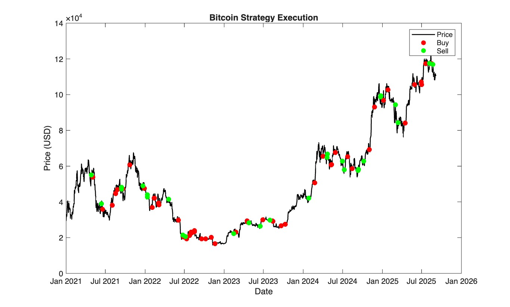

## Bitcoin Quantitative Backtesting Framework (MATLAB)
A high-performance MATLAB framework for systematic Bitcoin backtesting. This repository implements an algorithmic trading strategy that integrates Volatility-Adjusted Execution, Dynamic Breakout Detection, and Multi-Factor Momentum Filtering.

### 🚀 Key Features
ATR-Based Volatility Adaptation: Uses the Average True Range (ATR) to dynamically calibrate entry and exit thresholds, allowing the strategy to adapt to varying market regimes (Bull vs. Bear).

Fractional Position Sizing: Instead of binary "All-In/All-Out" logic, the system scales position sizes (between 75%–100%) based on the statistical strength of the signal.

Momentum Enhancement: Incorporates a 5-day momentum filter to confirm trend reversals, reducing "fake-out" entries in choppy sideways markets.

Smart Stop-Loss Engine: A trend-aware exit logic that monitors price slope and momentum to protect capital during flash crashes.

Deterministic Signal Tuning: Combines price fractions and temporal signals to provide a robust, repeatable "pseudo-random" fine-tuning for trade execution.

### 📂 Repository Structure
```
Bitcoin-trading-matlab/
├── README.md             # Project documentation (this file)
├── bitcoin.csv           # Historical OHLC price data (Date, Price, High, Low, Open)
├── mymethod.m            # Core Algorithm: Signal generation & position logic
├── report.m              # Execution Engine: Backtesting driver & auditing
└── strategy.jpg          # Automated visualization of trade execution
```
### 🛠️ Methodology

### Signal Generation

The core logic relies on normalizing price action against volatility. The buy/sell triggers are defined by:

$$
Signal = \frac{Price_{now} - Recent\_Extreme}{ATR}
$$

The `mymethod.m` function calculates:

- **Relative Slope**: Measures the velocity of price trends  
- **Overbought/Oversold Levels**: Standardized indicators for mean-reversion and momentum strategies

### 📊 Usage
To execute the backtest, run the following command in the MATLAB Command Window:
```
% Params: (csv_filename, start_day)
% Start_day should be > 20 to allow for indicator warm-up (ATR/Breakout)
final_balance = report('bitcoin.csv', 20);
```
Output:

Daily Ledger: Real-time printout of the wallet's total BTC-equivalent value.

Performance Metrics: Final BTC balance and its converted USD value.

Visualization: A high-resolution plot (strategy.jpg) showing Buy (Red) and Sell (Green) distribution over the price curve.

### 📈 Parameter Sensitivity Analysis
The strategy's performance is sensitive to several hyperparameters. Adjusting these can significantly impact the Sharpe Ratio and drawdown.


| Parameter      | Default | Description                 | Sensitivity |
|----------------|--------|-----------------------------|-------------|
| atrN           | 14     | ATR calculation window      | Medium: Higher values smooth volatility; lower values increase responsiveness. |
| breakoutN      | 5      | Breakout reference window   | High: Defines the "Recent High/Low." Critical for timing entries. |
| lowATR_mult    | 1.0    | Buy volatility multiplier   | High: Controls the depth of the "dip" required to trigger a buy. |
| highATR_mult   | 2.0    | Sell volatility multiplier  | High: Controls the target "peak" required to trigger a sell. |
| minHoldBTC     | 0      | Minimum holding amount      | Low: Used to maintain a "moon bag" or base position. |

### 🖼️ Results Preview

The strategy plot highlights the algorithm's ability to capture trend pivot points while protecting capital through ATR-based exit buffers.



### ⚠️ Disclaimer
This repository is for educational and research purposes only. Cryptocurrency markets are highly volatile. Past performance does not guarantee future results. Trade at your own risk.
